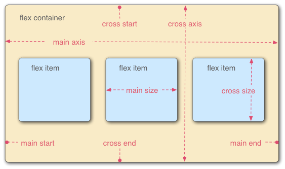

# HTML-CSS

### **Học xong làm được gì?**
1. Xây dựng được giao diện website (giao diện tĩnh)
2. Phân tích giao diện website
3. Đặt tên class theo chuẩn BEM
4. Xây dựng layout với Flexbox
5. Làm hiệu ứng layout với animation
6. Xây dựng giao diện responsive
7. Các kỹ thuật nâng cao khác...

### **CSS selectors**
| Selector | Mô tả|
| --- | --- |
| .abc | Chọn tất cả thẻ có class="abc" |
| .name1.name2 | Chọn tất cả các thẻ có cả name1 và name2 được đặt trong thuộc tính class của nó. |
| .name1  .name2 | Chọn tất cả các thẻ có class = "name2" là con của một phần tử có class="name1" |
| * | Chọn tất cả các thẻ |
| h2 | Chọn tất cả các thẻ h2 |
| div.box | Chọn tất cả thẻ div có class="box" |
| div, h2 | Chọn tất cả thẻ div và h2 |
|div p | Chọn tất cả thẻ p trong thẻ div |
| div > p | Chọn tất cả thẻ p là con trực tiếp của thẻ div |
| div + p | Chon thẻ p đứng liền kề sau thẻ div |
| div ~ p | Chọn tất cả thẻ p đứng sau thẻ div |

Reference: https://www.w3schools.com/cssref/css_selectors.asp

Priority: !important > Inline > #id > .class > tag-name > *

### **CSS variable:** when you want to define a value global and reuse in many places.

### **CSS units:**

**1. Absolute units:** px, pt, cm, mm, inch, pc

**2. Relative units:** %, rem, em, vw, vh, vmin, vmax, ex, ch
* % will depend on \<tag> which contain it. `font-size: 100% = 16px`
* rem will depend on \<html> 
* em will depend on  \<tag> **close to it** and that \<tag> have **font-size**
* vw - viewport width, vh - viewport height: kích thước trình duyệt. `1vw = 1% kích thước chiều ngang trình duyệt`

### **CSS pseudo-classes**
* :root - lớp giả tham chiếu tới html
* :hover - lướt chuột qua \<tag>
* :active - giữ chuột vào \<tag>
* :first-child - select đứa con đầu tiên
* :last-child - select đứa con cuối

### **CSS pseudo-elements**
* ::before - Trong một list thẻ con nằm trong \<tag> thì ::before luôn ở đầu
* ::after - Trong một list thẻ con nằm trong \<tag> thì ::before luôn ở đầu
* ::first-letter - Chữ cái đầu của text
* ::first-line - css cho dòng đầu tiên
* ::selection - css khi bôi chuột

**Note:** Ngoài css margin, padding, border. Thì ta có thuộc tính box-sizing với các giá trị:
* **border-box:** tự động tính toán content để khi content + padding + border = kích thước tổng width hoặc height
* **content-box(default):** trở về như khi chưa set box-sizing
* **unset:** hủy thuộc tính box-sizing trước đó

### **CSS Background**
* **background-clip**: quy định background đổ tới đâu. Value: border-box, padding-box, content-box
* **background-image**: đưa ảnh vào background. Default ảnh sẽ lặp đi lặp lại nên cần thêm **background-repeat: no-repeat**. background-image có thể có nhiều hình (url(), url())
* **background-size**: contain (Lấy kích thước dài nhất có thể theo chiều ngắn hơn), cover (Lấy kích thước dài nhất có thể theo chiều dài hơn, chấp nhận cả che khuất ảnh)
* **background-origin**: được sử dụng kèm với background-image, tương tự với background-clip
* **background-position**: top 20px right 20%
* **background**: url() no-repeat center / contain;

### **CSS Position**
* **relative**: Phụ thuộc vào vị trí của chính nó, lấy vị trí chính nó làm gốc tọa độ, ko bị ảnh hưởng bởi vị trí của mấy element khác. có thể sử dụng top, left, right, bottom khi dùng relative
* **absolute**: Lấy vị trí của thằng cha làm vị trí gốc. Thông thường thằng cha để position = relative.
* **fixed**: Lấy cửa sổ trình duyệt làm vị trí cố định. Thường làm cho header và footer. Khi người dùng kéo lên xuống thì ko bị mất.
* **sticky**: Khuyến cáo ko sử dụng vì ít trình duyệt hỗ trợ. Khác với fixed là sticky ko nằm cố định, khi lăn chuột tới một vị trí nhất định thì thẻ đó sẽ cố định (bám dính) vào vị trí đó.
* **Note**: Sử dụng thêm z-index để quy định element nào sẽ nằm trên element nào trong trường hợp các element đều có position.

### **Common website component**
* Header (Đầu trang)
* Nav - Navigation (Điều hướng của trang)
* Breadcrumb (Chỉ cho người dùng họ đang ở đâu)
* Sidebar (Thanh phân loại, điều hướng, lọc) - Thường nằm bên trái hoặc phải.
* Slider (Trình diễn nội dung chạy, thường là hình ảnh, trượt qua trượt lại được)
* Banner (Ảnh quảng cáo)
* Content (Nội dung chính website)
* Footer (Chân trang)

### **Experience**
* Display: 
    * Inline-block: có thể set width, height nhưng do nó kế thừa tính chất inline nên nó sẽ ko tự động co dãn theo thằng cha, nó chỉ co kích thước bằng chính nội dung của nó thôi.
    * Block: kế thừa chiều ngang của thẻ chứa nó. Khi có thuộc tính position thì thuộc tính kế thừa chiều ngang không còn nữa, phải sử dụng top, right, left, bottom
* Symbol: https://themify.me/themify-icons
* Khi element cha ko bao được hết element con do các thằng con sử dụng float. Ta xử lý bằng 2 cách
    * C1: Thêm thuộc tính `overflow: hidden` cho thằng cha. Overflow = hidden này nó sẽ ẩn hết các thằng con nằm ngoài thằng cha.
    * C2: thêm thẻ div.clear sau item cuối và css cho nó là `clear: both`
* Một element đang là inline nếu thêm property `float` vào thì nó sẽ thành block

### **Responsive**
* PC: >=1024px
* Tablet: >=740px & <1024px
* Mobile: < 740px
* **@media(max-width: 800px or min-width: 800px) {}**: Độ rộng tối đa là 800px thì CSS trong đó sẽ có hiệu lực
* Nên dùng đơn vị em cho responsive

### **CSS-layout Flexbox**

**Ta chia Flexbox thành 2 phần để tìm hiểu**
#### **Flex container**
* **flex-direction**: Thay đổi hướng của main axis (main axis sẽ quyết định các items con được display theo hướng nào)
    * **row (Default)**: Khi để thằng cha là `display: flex` thì các flex items sẽ có direction mặc định là row
    * **row-reverse**: như trên nhưng chiều ngược lại từ phải sang trái
    * **column**: từ trên xuống dưới
    * **column-reverse**: từ dưới lên trên
* **flex-wrap**: nowrap | wrap | wrap-reverse - Xuống dòng hay không
* **align-items**: Cách mà các flex items được căn theo cross axis
    * **flex-start**: căn theo cross start line
    * **flex-end**: căn theo cross end line
    * **center**: căn giữa cross axis
    * **baseline**: căn theo baseline của cross axis (baseline là chân content của flex items)
    * **stretch**: kéo các flex items từ cross start tới cross end
* **justify-content**: Cách mà các flex items được căn theo main axis
    * **flex-start**: căn theo main start line
    * **flex-end**: căn theo main end line
    * **center**: căn giữa main axis
    * **space-between**: căn theo hướng main axis sao cho khoảng cách giữa các flex items là lớn nhất, bỏ margin đầu cuối
    * **space-around**: space giữa các flex items gấp đôi space before và space after
    * **space-evenly**: space giữa các flex items bằng space before và space after
* **align-content**: Cách mà các flex items trong nhiều multiple lines được căn hay nói là căn những cái lines trong grid items.
    * **flex-start**: căn hết các lines lên cross start
    * **flex-end**: căn hết các lines xuống cross end
    * **center**: căn giữa cross axis
    * **space-between**: chỉ space remain giữa các lines
    * **space-around**: space remain giữa các lines và ngoài line đầu - line cuối
    * **stretch**:  space reamain sẽ chia đều thêm làm tăng kích thước cho các lines
* **flex-flow**: \<flex-direction> \<flex-wrap>
* **flex-basic**: <length> - Thiết lập kích thước main size

#### **Flex items**
* **align-self**: Căn một flex item theo cross axis
    * **flex-start**: căn một flex item theo cross start line
    * **flex-end**: căn một flex item theo cross end line
    * **center**: căn một flex item giữa cross axis
    * **baseline**: căn một flex item theo baseline của cross axis (baseline là chân content của flex item)
    * **stretch**: kéo flex item từ cross start tới cross end
* **flex-grow**: \<number> chỉnh kích thước tăng cho item. Default: 0
* **flex-shrink**: \<number> co kích thước item lại. Default: 0
* **justify-self**: flex-start | flex-end | center - kế thừa từ justify-self
* **flex**: .item { flex: [flex-grow] [flex-shrink] [flex-basis]; }
* **order**: \<number>: gán thứ tự cho các element. Default: 0.

**Reference to pratice Flexbox:**

    * https://codepen.io/enxaneta/full/adLPwv/
    * https://flexboxfroggy.com/#vi
    * https://cssgridgarden.com/#vi
    * http://www.flexboxdefense.com/
    * https://flukeout.github.io/

### **Quy ước đặt tên class BEM**
- Là tiêu chuẩn đặt tên class khi viết CSS

#### Ý nghĩa
* Viết tắt của Block Element Modifier
* Block: Khối
* Element: Thành phần trong khối
* Modifier: Bổ sung ý nghĩa cho `Block` hoặc `Element`

#### Tại sao phải dùng BEM?
* Mỗi người mỗi style nên ko thể thống nhất khi làm chung
* Member đặt class trùng nhau, CSS đè lên nhau

#### Cú pháp
* .block
* .block__element

* .block--modifier. EX: card--success
* .block__element--modifier

#### Ưu điểm
* Tính rõ ràng
* Tái sử dụng dễ dàng
* Tính module, không lo CSS của class này ảnh hưởng lên CSS của class khác

#### Trường hợp Block lồng Block (Tránh việc selector quá dài, ta chuyển element -> block)
- Block con là thành phần dùng chung
- Block con chứa nhiều elements

